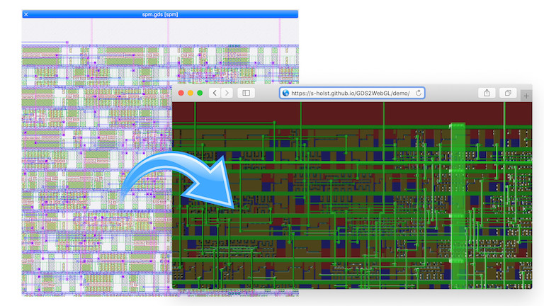

# GDS2WebGL

This tool provides a performant, portable, and approachable way to visualize and browse chip layout data.
It does so by translating the geometric shapes found in [GDSII stream format](https://en.wikipedia.org/wiki/GDSII) into a self-contained HTML file that can be viewed in any modern [WebGL](https://en.wikipedia.org/wiki/WebGL)-capable web browser.
The generated view can be panned and zoomed similar to popular map services.
The HTML designed to be served locally or via an HTTP server and to be viewed in all modern web browsers on PCs, Macs, as well as touch-enabled tablets and smartphones.

[](https://s-holst.github.io/GDS2WebGL/examples/spm.html)
[Interactive Demo](https://s-holst.github.io/GDS2WebGL/examples/spm.html)

## Why?

The structures in a VLSI chip are inherently 3D with a layer of transistors covered by several layers of interconnect.
Especially for beginners, these structures are difficult to understand by looking at 2D top-down projections of all the layers with various colors and shades in tools like [Magic VLSI](http://opencircuitdesign.com/magic/), [KLayout](https://www.klayout.de) or [OwlVision](http://www.owlvision.org).
[GDS3D](https://github.com/skuep/GDS3D) renders 3D views of the structures but also requires installation is not available on mobile platforms.
GDS2WebGL generates a 3D top-down view into the layout structures with some perspective distortion to give good visual cues into the stackup.


## How to Use?

The tool is a single python3 script. It requires the packages [gdspy](https://pypi.org/project/gdspy/), [pyclipper](https://pypi.org/project/pyclipper/) and [mapbox_earcut](https://pypi.org/project/mapbox-earcut/). To translate a GDSII file, clone or download this git repo and call:
```
python3 gds2webgl.py -i file.gds -o file.html 
```
Currently, this script is a proof-of-concept. It works on small GDSII files generated by the [openlane](https://github.com/efabless/openlane) flow with the [Skywater 130nm PDK](https://github.com/google/skywater-pdk). To be useful for other GDS files, the layer definitions contained in the script needs to be changed.


## What Happens Under The Hood?

The `gds2webgl.py` script extracts the polygons from the GDSII file, merges all polygons on each layer (union operation) and splits the merged polygons into triangles. The vertex and face data is encoded into Javascript/JSON with Base64 strings. The encoded data can be dumped by using a file with `.js` suffix as output:
```
python3 gds2webgl.py -i file.gds -o data.js 
```
To generate the self-contained HTML file, the script combines the raw data with `index.html` and boilerplate Javascript code in `bundle.js` found in the same directory. During development, you can dump `data.js` and open `index.html` in a browser.

`bundle.js` contains all the browser-side code for initializing the WebGL canvas, importing the Base64-encoded geometry data and interacting with user events. It is generated from `app.js` and its dependent node.js packages with [browserify](http://browserify.org). To change the browser-side code, install the dependencies (`npm install`) and call `make` or `npm run build` to make a new `bundle.js` from `app.js`.